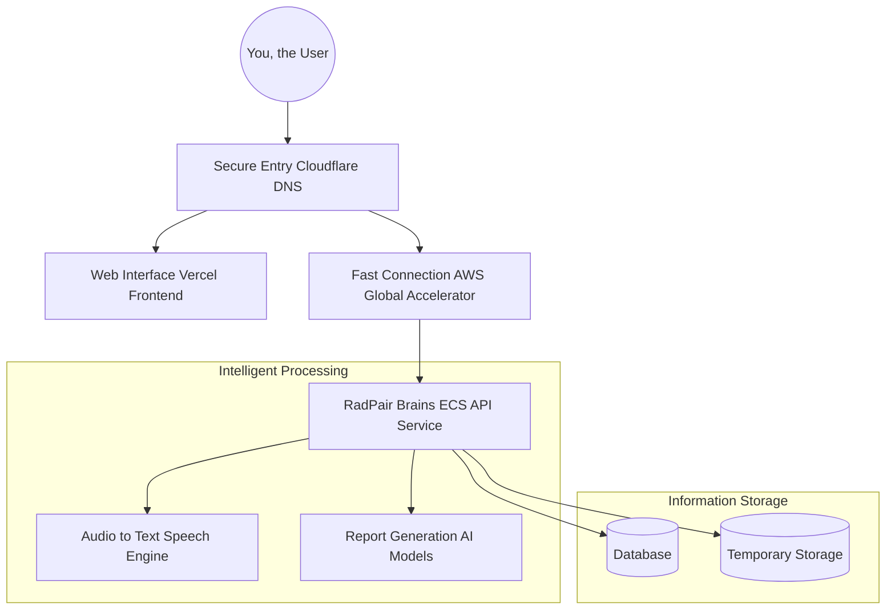

# Welcome to the RadPair Platform Documentation

## Your Guide to RadPair

RadPair is a cutting-edge medical reporting platform, built using the latest cloud technologies on AWS. It's designed to make radiology reporting faster, more accurate, and more secure. Whether you're a developer, an operations team member, a client, or an auditor, this documentation will help you understand RadPair and its capabilities.

## Explore RadPair

Think of RadPair as having three core areas:

**How it's Built (Architecture):**  This covers the technical blueprint of RadPair, from its foundational infrastructure to the specific technologies used. It explains how all the pieces fit together.

[**Dive into the Architecture Details &rarr;](./architecture.md)

**How it Gets Here (Deployment):** This explains the process of taking the RadPair platform from development to a live, usable service. It details our automated and reliable deployment methods.

[**Learn about the Deployment Process &rarr;](./deployment.md)

**How it Runs Day-to-Day (Operations):** This focuses on the ongoing management of RadPair, including monitoring, troubleshooting, and ensuring its continuous, reliable operation.

[**Understand RadPair Operations &rarr;](./operations.md)

## RadPair at a Glance

Here’s a simplified view of the key elements that make up the RadPair platform:

**What Makes RadPair Special?**

Instead of a long list, here are some highlights of RadPair's capabilities:

*   **Turns Speech into Text, Instantly:**  Using powerful technology, RadPair converts spoken words into written reports in real-time.
*   **AI Helps Create Reports:** RadPair uses artificial intelligence to structure and assist in generating accurate medical reports.
*   **Keeps Data Safe and Secure:**  Protecting sensitive medical information is a top priority, with robust security measures in place.

**Key Activities for Keeping RadPair Running:**

*   **Keeping a Close Watch (Health Monitoring):** We use tools like Datadog to continuously monitor RadPair's health and performance.
*   **Making Updates Smoothly (Deployment):**  New features and improvements are rolled out automatically and without interrupting service.
*   **Scaling to Meet Demand (Scaling):** RadPair can automatically adjust its resources to handle increases in usage.
*   **Protecting Our Data (Backup):**  We have automated systems to regularly back up our data, ensuring it's safe.

## Navigating the Documentation - Find What You Need

**If you're a Developer:**

*   Start with the [Architecture Documentation](./architecture.md) to understand the system's design.
*   Consult the [Deployment Guide](./deployment.md) for details on setting up your development environment and understanding the deployment process.

**If you're in Operations:**

*   The [Operations Guide](./operations.md) is your go-to resource for monitoring, troubleshooting, and maintaining the platform.
*   Pay special attention to sections on setting up monitoring and managing alerts.

**If you need to Review Security or Compliance:**

*   The [Architecture Documentation](./architecture.md#security) provides a comprehensive overview of our security measures.
*   Review the sections on compliance requirements, access controls, and audit procedures within the architecture document.

## Getting Help and Staying Informed

**Need Assistance?**

1. Refer to the [Operations Guide](./operations.md) for troubleshooting steps and common issues.
2. Check our monitoring dashboards for real-time status information.
3. Follow the incident response procedures outlined in the Operations Guide for critical issues.

**Staying Up-to-Date:**

This documentation is a living document and is updated regularly to reflect the latest changes and improvements to the RadPair platform. Always refer back to the specific documentation files for the most current information.

*Last updated: 2024-03-19*
