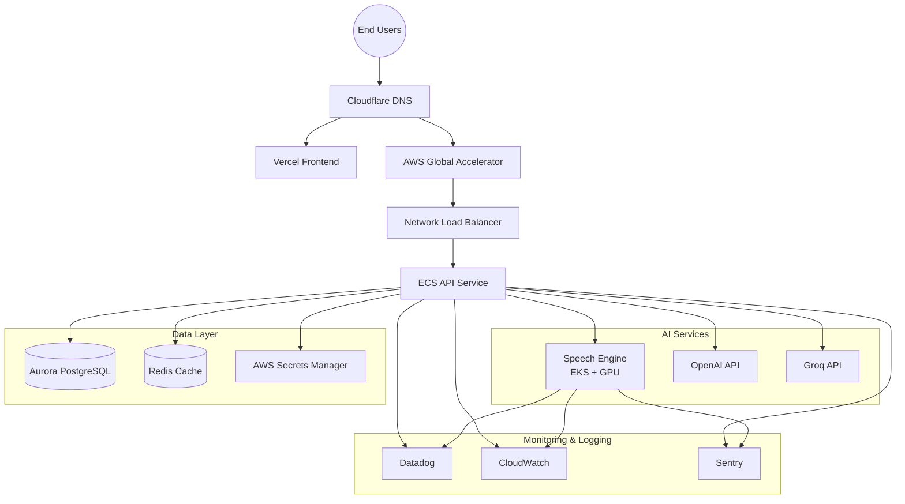
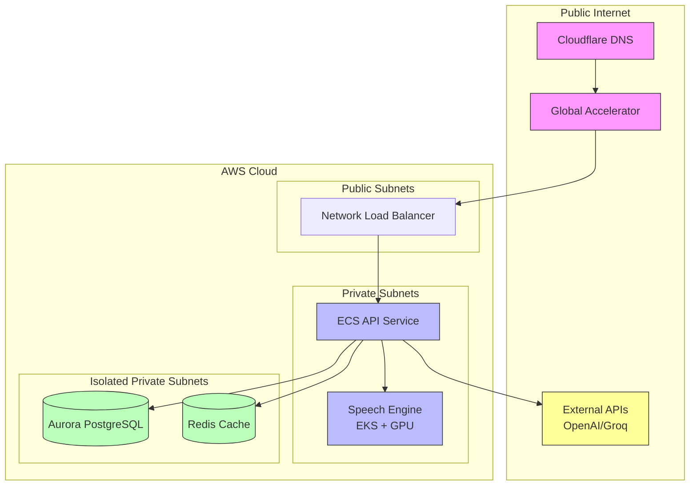
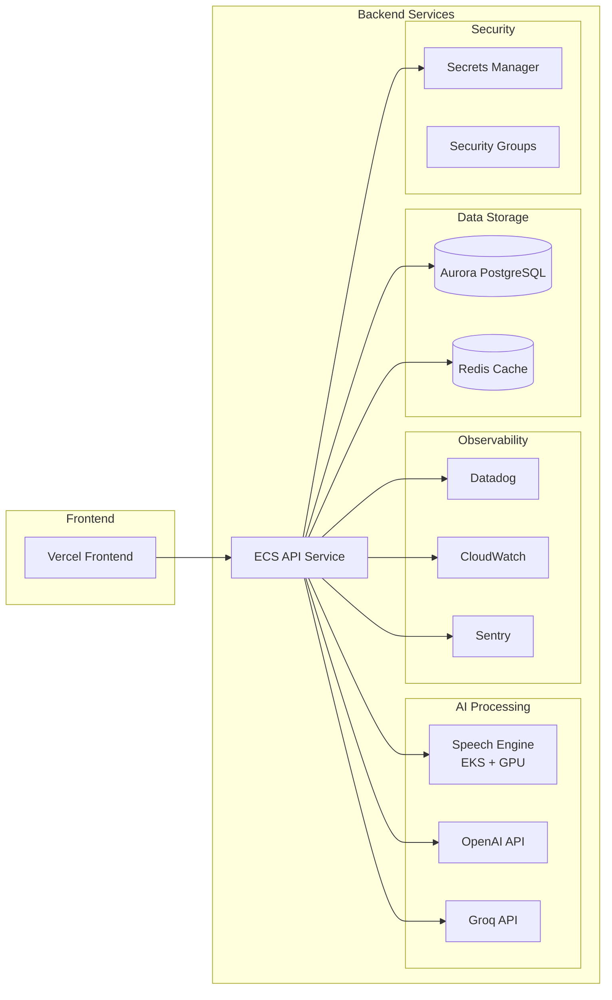
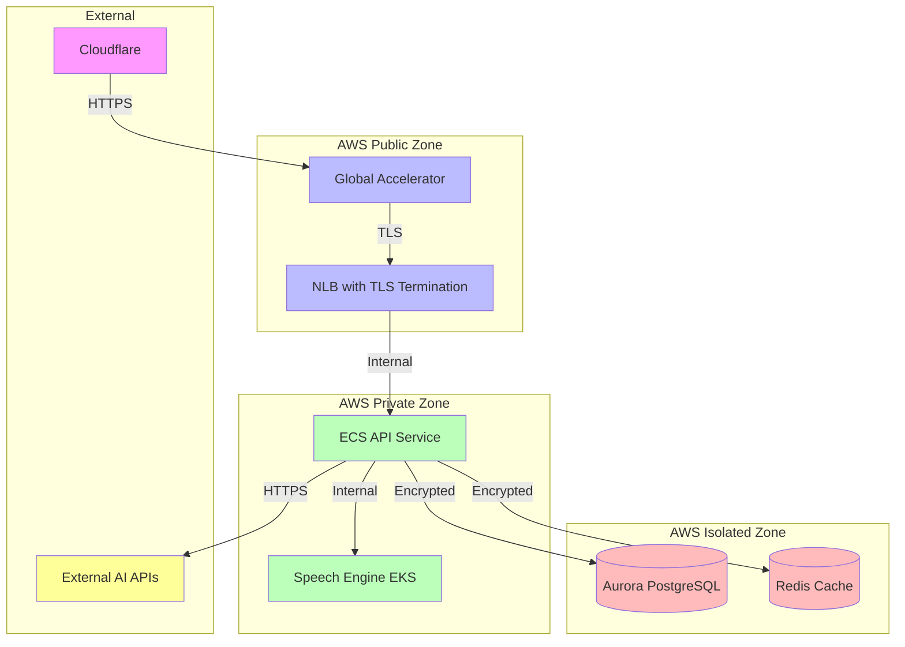
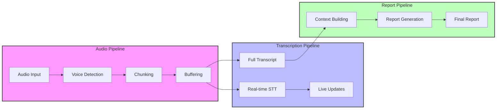
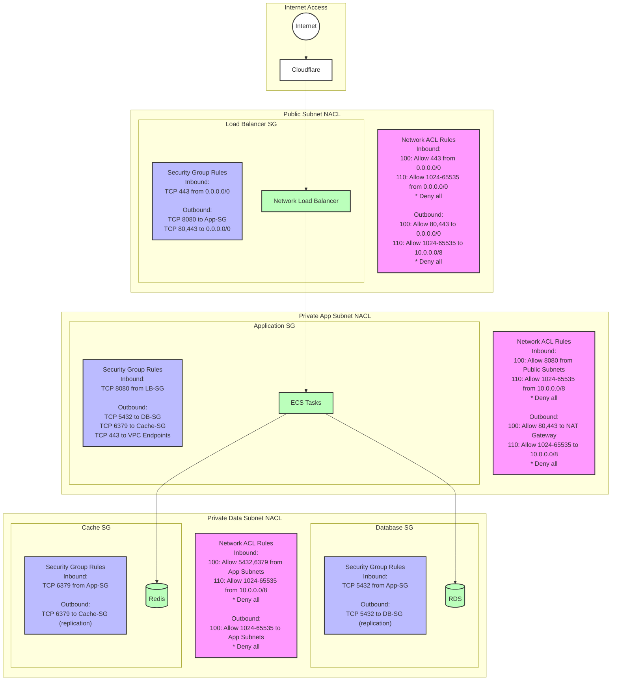
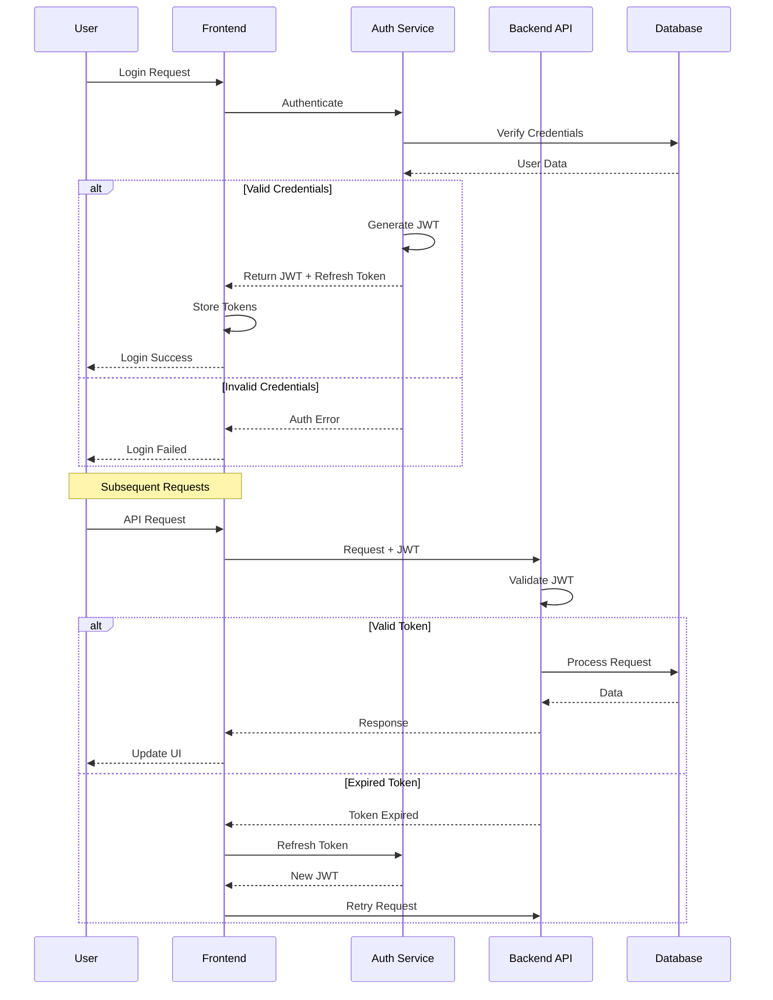

# RadPair Platform Architecture

## Table of Contents
1. [Overview](#overview)
2. [Key Capabilities](#key-capabilities)
3. [Architecture Diagrams](#architecture-diagrams)
4. [Core Architecture](#core-architecture)
5. [Data Flow](#data-flow)
6. [Architectural Principles](#architectural-principles)
7. [System Architecture](#system-architecture)
8. [Security Architecture](#security-architecture)
9. [Scalability Strategy](#scalability-strategy)
10. [Reliability and High Availability](#reliability-and-high-availability)
11. [Compliance and Auditing](#compliance-and-auditing)
12. [Disaster Recovery Plan](#disaster-recovery-plan)

## Overview

The RadPair Platform built on Amazon Web Services (AWS) cloud infrastructure, adhering to modern cloud-native architecture principles. This design ensures a secure, scalable, and highly available service. The platform employs a modular architecture, utilizing containerized deployments and implementing industry best practices for security and compliance. This document outlines the platform's architecture and its capabilities.

## Key Capabilities

**Real-time Audio Transcription:**  Leveraging GPU-accelerated Kubernetes clusters, the platform provides advanced speech-to-text processing. This includes real-time transcription with background noise reduction, specifically optimized for medical terminology and radiology vocabulary. The low-latency processing ensures immediate feedback during dictation.

**AI-Powered Radiology Report Generation:**  Intelligent report structuring is achieved through fine tuned custome AI models integrated with OpenAI and Groq APIs. The system automatically selects appropriate templates based on the study type and uses context-aware medical terminology processing. Quality assurance checks are incorporated to ensure report accuracy.

**Secure Data Handling and Storage:**  Security is paramount. All data is protected with end-to-end encryption, both in transit and at rest. Role-Based Access Control (RBAC) is implemented to manage user permissions. AWS Secrets Manager is used for secure key management, and regular security audits and penetration testing are conducted to maintain a high security posture.

**High Availability Infrastructure:**  The platform is deployed across multiple AWS Availability Zones (Multi-AZ) to ensure resilience. Automated failover mechanisms are in place to handle infrastructure issues. Load balancing is managed through AWS Global Accelerator for optimized performance and availability. Real-time system health monitoring provides insights into the platform's operational status.

**Scalable Modular Architecture:** The architecture allows for independent scaling of both ECS and EKS components. Its microservices-based design ensures component isolation and resilience. Auto-scaling is implemented based on demand metrics, allowing for efficient resource utilization across all services.

**HIPAA-Compliant Data Management:** The platform adheres to HIPAA and SOC2 standards. It features extensive audit logging and monitoring, encrypted storage and transmission of data, strong access controls and authentication measures, and routine assessments and updates to maintain regulatory compliance.

## Architecture Diagrams

### High-Level System Architecture

### Network Architecture

### Application Components

### Security Boundaries

## Core Architecture

The RadPair system is structured into distinct tiers to separate concerns, enhance scalability, and ensure robust security. Each tier has specific responsibilities with clear boundaries and interfaces.

**Client Tier (Vercel Global CDN):** This tier hosts the frontend application, delivering content globally for optimal user experience. It provides the user interface for interacting with the RadPair system, utilizing real-time WebSocket clients for seamless backend communication. Leveraging Vercel's edge network ensures high performance for users worldwide.

**Load Balancing Tier (AWS):**  This tier efficiently manages incoming traffic. The Network Load Balancer (NLB) operates at Layer 4, distributing traffic and managing WebSocket connections across backend instances. Its integration with AWS Global Accelerator optimizes routing through the AWS global network, reducing latency and improving throughput for users across different geographical locations.

**Application Tier (ECS Fargate):**  The application tier consists of containerized services running on AWS ECS Fargate. This provides isolated runtime environments with automated scaling capabilities and efficient resource optimization. The backend API servers in this tier implement the core business logic, providing RESTful API endpoints and WebSocket handlers for real-time features.

**AI Processing Tier (EKS GPU):**  The AI processing tier leverages GPU-accelerated Kubernetes clusters for advanced speech-to-text processing and report generation. This ensures high-performance and efficient utilization of computational resources, particularly for medical terminology and radiology-specific processing.

**Data Tier:** This tier is responsible for data persistence and retrieval.

*   **Aurora PostgreSQL:**  Serves as the primary relational database, ensuring structured data persistence, transaction management, and high availability through Multi-AZ deployment.
*   **Redis Cache:** Provides high-performance caching, manages real-time data streams, handles session state, and supports publish/subscribe functionalities.
*   **S3 Object Storage:** Offers scalable and cost-effective storage for audio recording archives and report documents, suitable for long-term retention.

## Data Flow

The RadPair system processes data through three interconnected pipelines, each tailored for specific aspects of the medical reporting workflow. This structured approach ensures efficient and reliable data handling.

**1. Audio Pipeline:** This pipeline focuses on capturing and preparing the audio input.

*   **Audio Input:** The process begins with capturing the raw audio stream from the user's device through secure WebSocket connections, accommodating various audio formats and qualities.
*   **Voice Detection:**  Silero VAD is used to precisely detect voice activity, filtering out background noise and silence to optimize subsequent processing.
*   **Chunking:** The audio is then segmented into optimal sizes for processing, using intelligent chunking based on natural speech patterns to maintain context.
*   **Buffering:** Finally, the audio chunks are temporarily stored, employing efficient memory management to ensure a smooth processing flow.

**2. Transcription Pipeline:** This pipeline handles the conversion of audio to text.

*   **Real-time STT (Speech-to-Text):**  Audio chunks are processed in parallel using a GPU-accelerated EKS cluster, optimized for accuracy with medical terminology.
*   **Live Updates:** Real-time transcriptions are delivered to the user interface via WebSocket, implementing progressive rendering and handling error recovery.
*   **Full Transcript:** Once the complete audio is processed, the full transcription is assembled, undergoing post-processing for accuracy and maintaining formatting.

**3. Report Pipeline:** This pipeline focuses on generating the final medical report.

*   **Context Building:** The full transcript is analyzed to build medical context, extracting key findings and observations through integration with medical knowledge bases.
*   **Report Generation:** AI models (Groq/OpenAI) are leveraged to create structured reports based on medical reporting templates, with built-in quality checks.
*   **Final Report:** The report is formatted according to industry standards, allowing for review and modification, and supporting multiple export formats.

Each pipeline is designed with error handling, performance monitoring, security controls, and scalability considerations to ensure reliable and secure operation.

## Architectural Principles

The RadPair Platform is guided by the following core architectural principles:

*   **Security-First Design:** Security is integrated into every layer of the platform, ensuring data protection and system integrity.
*   **High Availability:** The system is designed to be resilient to component and availability zone failures, minimizing downtime.
*   **Horizontal Scalability:** The architecture allows for scaling out resources to handle increased load, ensuring optimal performance under varying demands.
*   **Infrastructure as Code:** All infrastructure is defined and managed through version-controlled code, enabling automation and consistency.
*   **Observability:** Comprehensive monitoring and logging are implemented across all system components, providing insights into performance and potential issues.

## System Architecture

### Network Architecture

The platform employs a multi-layer network design to enhance security and manageability.

*   **Public Layer:** Houses load balancers for external access.
*   **Application Layer:** Resides in private subnets, providing a secure environment for application logic.
*   **Data Layer:** Located in isolated private subnets, ensuring restricted access to sensitive data.
*   **Network Segmentation:** Security groups and Network Access Control Lists (NACLs) are used to enforce network segmentation.
*   **Global Edge Network:** AWS Global Accelerator provides optimized routing and multi-region traffic management, while also offering DDoS protection at the edge.

### Compute Layer

The compute layer leverages container orchestration for efficient resource management.

*   **Container Orchestration:** An ECS cluster is deployed across multiple availability zones for high availability.
*   **Auto-scaling:**  Scaling is automated based on CPU, memory, and custom metrics to meet fluctuating demands.
*   **Task Isolation:**  Resource management and isolation are enforced at the task level.
*   **Blue-Green Deployments:** The platform supports blue-green deployments for seamless updates and reduced downtime.

### Data Layer

The data layer is designed for reliability, performance, and security.

*   **Relational Database:** Aurora PostgreSQL is deployed in a Multi-AZ configuration for high availability, with automated backups, point-in-time recovery, read replicas for scalability, and encryption at rest and in transit.
*   **Caching Layer:** Redis provides in-memory caching for improved performance, deployed in a Multi-AZ configuration with automatic failover and encryption.

## Security Architecture

The RadPair Platform incorporates a robust security architecture with multiple layers of protection.

### Network Security Architecture

The platform utilizes a combination of Network Access Control Lists (NACLs) and Security Groups to control network traffic.

Key network security components include:

1. **Network ACLs (Subnet Level):** These provide stateless filtering of network traffic at the subnet level. Rules are numbered and processed sequentially, with a default deny-all policy. Separate inbound and outbound rules offer fine-grained control, allowing only explicitly permitted traffic.
2. **Security Groups (Instance Level):** Acting as stateful firewalls, Security Groups track connections, allowing return traffic. Rules often reference other security groups for simplified management. They operate with a default deny-all inbound policy and a default allow-all outbound policy, utilizing only allow rules without explicit deny rules.
3. **Traffic Flow Control:**  The public subnet only accepts HTTPS traffic from the internet, protected by Cloudflare. The application tier only allows traffic from the load balancer, and the data tier is accessible only from the application tier, preventing direct internet access. Cross-AZ replication traffic is permitted within the data tier for high availability.
4. **Security Best Practices:**  The platform adheres to the principle of least privilege, granting only necessary network access. Traffic flow isolation between tiers minimizes the impact of potential breaches. Direct database access from the internet is prohibited, and a layered security approach combining NACLs and Security Groups is employed.

### Authentication and Authorization

User and service authentication are critical aspects of the platform's security.

*   **User Authentication:** JWT (JSON Web Token)-based authentication provides stateless and scalable user sessions. Integration with OAuth2 facilitates delegated authorization, and Multi-Factor Authentication (MFA) adds an extra layer of security. Secure session management practices are implemented to protect user credentials.
*   **Service Authentication:** IAM roles for ECS tasks grant secure and granular permissions to AWS resources. AWS Secrets Manager securely stores and manages sensitive credentials. Service-to-service authentication mechanisms are used for internal components, and API key management is in place for external APIs and services.

### Data Protection

Data protection measures are implemented both at rest and in transit.

*   **Data at Rest:** RDS encryption using AWS KMS protects database data. S3 server-side encryption secures objects in S3 buckets. ElastiCache encryption protects data in Redis, and volume encryption is used for ECS tasks.
*   **Data in Transit:** TLS 1.3 is enforced for all external traffic. VPC endpoints are used for internal AWS service communication, and mTLS enhances security for service-to-service communication.

## Scalability Strategy

The RadPair platform is designed for horizontal scalability to handle increasing demands.

*   **Horizontal Scaling:** Auto-scaling groups manage compute resources, read replicas scale databases, caching layers can be scaled, and load balancers automatically adjust capacity.
*   **Performance Optimization:** Content delivery is optimized through CDNs, database queries are tuned for efficiency, caching strategies are employed, and resource utilization is continuously monitored.

## Reliability and High Availability

Reliability and high availability are ensured through redundant infrastructure and fault-tolerant mechanisms.

*   **Infrastructure Redundancy:** Multi-AZ deployments, redundant load balancers, database failover capabilities, and cache cluster redundancy minimize single points of failure.
*   **Fault Tolerance:** Automatic failover mechanisms, circuit breakers, retry mechanisms with exponential backoff, and rate limiting contribute to the system's resilience.
*   **Monitoring & Recovery:** Health checks at all layers, automated recovery procedures, performance monitoring, and capacity planning ensure proactive issue detection and resolution.

## Compliance and Auditing

The platform is built with compliance and auditing requirements in mind.

*   **Audit Capabilities:** Comprehensive audit logging tracks access, changes, and resource modifications.
*   **Compliance Controls:** HIPAA compliance measures, GDPR readiness, SOC 2 compliance controls, and regular security assessments ensure adherence to regulatory standards.

## Disaster Recovery Plan

The platform has a well-defined disaster recovery plan to ensure business continuity.

*   **Backup Strategy:** Automated and cross-region backups with point-in-time recovery capabilities are in place. Regular backup testing validates the recovery process.
*   **Recovery Procedures:** Defined Recovery Time Objective (RTO) and Recovery Point Objective (RPO), documented recovery procedures, regular disaster recovery testing, and a comprehensive business continuity plan ensure the platform can recover from disruptive events.
