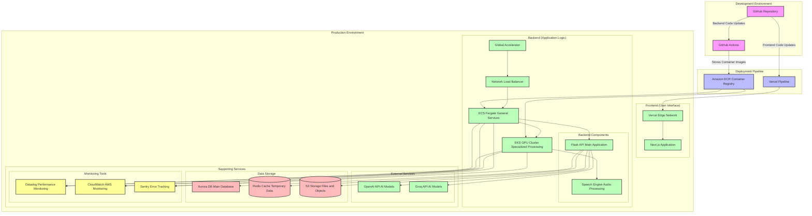
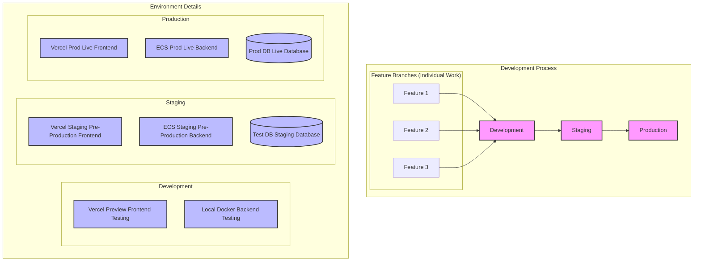
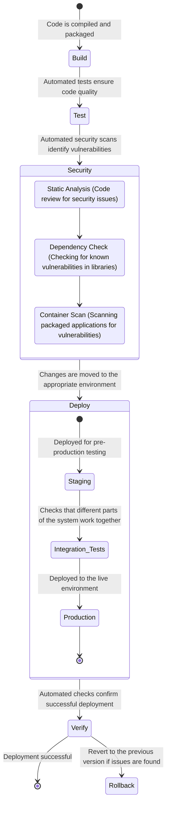
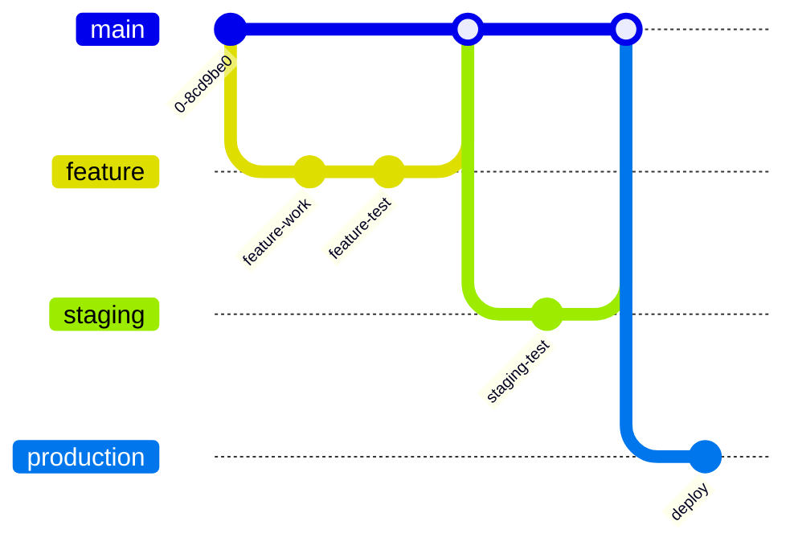
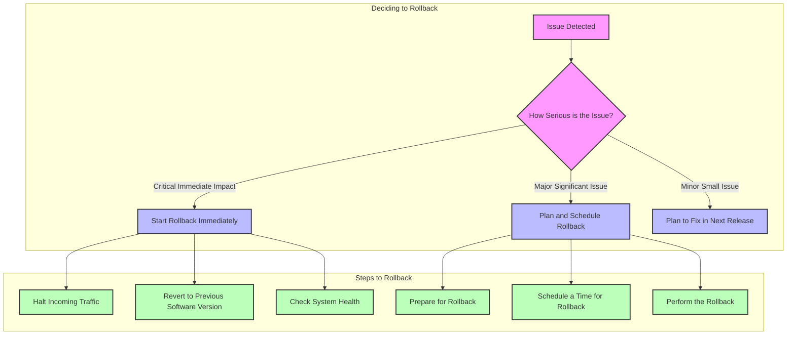

# RadPair Deployment Guide

## Table of Contents
1. [Deployment Overview](#deployment-overview)
2. [Environment Strategy](#environment-strategy)
3. [Deployment Process (CI/CD)](#deployment-process-cicd)
4. [Deploying Changes](#deploying-changes)
5. [Understanding Version Control](#understanding-version-control)
6. [Undoing a Deployment (Rollback)](#undoing-a-deployment-rollback)
7. [Monitoring and Checking Deployments](#monitoring-and-checking-deployments)
8. [Troubleshooting Common Issues](#troubleshooting-common-issues)

## Deployment Overview

This document outlines how updates and new features are deployed to the RadPair platform. We use automated processes to ensure reliable and consistent deployments across our different environments. This involves a series of steps from code changes to making them live for our users.

### System Components and Flow

The diagram below illustrates the main components involved in our deployment process, from code changes to the live platform:



This diagram illustrates how code changes flow from our developers' work to the live platform. Key stages include development, automated checks, and deployment to the final production environment.

### Our Environment Approach

We utilize a tiered environment strategy to manage changes safely:



*   **Development:** Where developers build and test new features.
*   **Staging:** A near-identical copy of the production environment used for final testing and verification.
*   **Production:** The live environment used by our users.

This structured approach minimizes risks by isolating changes and allowing thorough testing before reaching the production environment.

## Deployment Process (CI/CD)

We use a Continuous Integration and Continuous Deployment (CI/CD) pipeline to automate the deployment process. This ensures that changes are built, tested, and deployed in a consistent and reliable manner.

### Overview of the Deployment Workflow



This workflow outlines the automated steps our code goes through, from initial build to deployment and verification. Security checks are integrated to ensure a safe and reliable platform.

### Frontend Deployment (Automated via Vercel)

Our frontend (user interface) is automatically deployed using Vercel. Whenever changes are made to the frontend code, Vercel automatically builds and deploys these changes.

```yaml
# Vercel Build Configuration Example
builds:
  - src: frontend/**
    use: @vercel/next
    config:
      maxDuration: 900  # Maximum time allowed for the build process (in seconds)
      memory: 3008       # Amount of memory allocated for the build process (in MB)
      regions:
        - all          # Deploy to all Vercel edge network regions for faster access
      env:
        - API_URL           # Environment variable for the backend API URL
        - NEXT_PUBLIC_API_URL # Environment variable accessible in the browser
```

This configuration tells Vercel how to build and deploy our frontend application.

### Backend Deployment (Automated via GitHub Actions)

Our backend services are deployed using GitHub Actions, which automates the build, test, and deployment process when code changes are made.

```yaml
name: Deploy Backend
on:
  push:
    branches: [main] # Trigger deployment when code is pushed to the 'main' branch
  pull_request:
    branches: [main] # Also trigger when a pull request is made to the 'main' branch

jobs:
  test:
    runs-on: ubuntu-latest # Use a standard Ubuntu environment to run tests
    steps:
      - uses: actions/checkout@v3 # Get the latest code
      - name: Run Tests
        run: make test # Execute the tests defined in our Makefile

  security:
    needs: test # This job runs after the 'test' job is successful
    runs-on: ubuntu-latest
    steps:
      - name: SAST Scan
        uses: github/codeql-action/analyze@v2 # Use GitHub's built-in code analysis for security
      - name: Container Scan
        uses: aquasecurity/trivy-action@master # Scan our container images for vulnerabilities

  deploy:
    needs: security # This job runs after the 'security' job is successful
    runs-on: ubuntu-latest
    steps:
      - uses: actions/checkout@v3
      - name: Configure AWS
        uses: aws-actions/configure-aws-credentials@v1 # Configure AWS credentials for deployment
      - name: Login to ECR
        uses: aws-actions/amazon-ecr-login@v1 # Log in to Amazon's container registry
      - name: Build and Push
        run: |
          docker build -t $ECR_REGISTRY/backend-api:$TAG . # Build the backend API container
          docker build -t $ECR_REGISTRY/speech-engine:$TAG ./speech-engine # Build the speech engine container
          docker push $ECR_REGISTRY/backend-api:$TAG # Upload the backend API container
          docker push $ECR_REGISTRY/speech-engine:$TAG # Upload the speech engine container
      - name: Deploy with Copilot
        run: |
          copilot svc deploy --name backend-api --env prod # Deploy the backend API service
          copilot svc deploy --name speech-engine --env prod # Deploy the speech engine service
```

This configuration defines the steps for building, testing, securing, and deploying our backend services.

## Deploying Changes

### Commands for Common Backend Operations

Here are some useful commands for developers working on the backend:

```bash
# Local Development Setup
make build                  # Build all the necessary container images
make up                     # Start the entire RadPair platform locally (for development)
make up-backend            # Start only the backend services locally (for faster iteration)

# Container Image Management
make build-push-backend    # Build the backend API container image and upload it
make build-push-speech     # Build the speech engine container image and upload it

# Deployment Commands (used by the automated pipeline)
copilot svc deploy --name backend-api --env prod # Deploy the backend API service to the production environment
copilot svc deploy --name speech-engine --env prod # Deploy the speech engine service to the production environment

# Checking Status and Logs
copilot svc status --name backend-api --env prod # Check the current status of the backend API service in production
copilot svc logs --name backend-api --env prod --follow # View the real-time logs of the backend API service in production
```

These commands are primarily used by developers for local development and for understanding the automated deployment process.

### How Database Changes are Managed

Database changes are managed through a process called migrations. This ensures that the database structure is updated in a controlled and versioned manner.

```bash
# 1. Create a Backup of the Production Database (as a precaution)
aws rds create-db-snapshot \
    --db-instance-identifier radpair-prod \
    --db-snapshot-identifier pre-migration

# 2. Apply the Database Changes (Migrations) to the Production Database
copilot task run \
    --app platform-api \
    --env prod \
    --command "flask db upgrade"

# 3. Verify that the Database Changes were Applied Successfully
copilot task run \
    --app platform-api \
    --env prod \
    --command "flask db current"
```

This process ensures that database changes are applied safely and can be tracked.

## Understanding Version Control

### How We Manage Code Changes

We use Git for version control to track all changes to our codebase. This allows us to collaborate effectively and manage different versions of our software.



This diagram illustrates a typical workflow:

*   **Feature Branches:** Developers work on new features in isolated branches.
*   **Merging:** Once complete, features are merged into the `main` branch.
*   **Staging:** Changes are then moved to a `staging` branch for final testing.
*   **Production:**  Finally, tested and approved changes are merged into the `production` branch and deployed.

### How We Name Software Versions

We use a standard versioning system to track releases: `vMAJOR.MINOR.PATCH`.

```
v1.0.0    # Initial release of the software
v1.0.1    # A small update, usually a bug fix
v1.1.0    # A release with new features added
v2.0.0    # A major release that might include significant changes
```

This helps everyone understand the scope and nature of each release.

## Undoing a Deployment (Rollback)

### When and How We Revert to a Previous Version

Rollbacks are sometimes necessary if a deployment introduces issues. Here's how we handle them:



This diagram illustrates the decision-making process for initiating a rollback and the different steps involved depending on the severity of the issue.

### Commands to Perform a Rollback

Here are the commands used to rollback deployments:

```bash
# Frontend Rollback (using Vercel)
vercel rollback

# Backend Service Rollback (using Copilot)
copilot svc rollback -n backend-api -e prod # Rollback the backend API service in production
copilot svc rollback -n speech-engine -e prod # Rollback the speech engine service in production

# Database Rollback (restoring from a previous backup)
aws rds restore-db-instance-from-db-snapshot \
    --db-instance-identifier radpair-prod \
    --db-snapshot-identifier pre-deployment
```

These commands allow us to quickly revert to a stable previous version if necessary.

## Monitoring and Checking Deployments

### How We Ensure Deployments are Successful

We use a variety of checks and monitoring tools to ensure deployments are successful and the platform is functioning correctly.

### Key Health Checks

We regularly check the health of our components:

| Component     | How We Check It                                  | What a Good Result Looks Like | Where We Monitor It        |
|---------------|---------------------------------------------------|------------------------------|----------------------------|
| Frontend      | Visiting `https://radpair.com/health`            | `{"status": "ok"}`           | Datadog APM (Application Performance Monitoring) |
| Backend API   | Visiting `https://api.radpair.com/health`        | `{"status": "ok"}`           | Datadog APM                |
| Speech Engine | Visiting `https://stt.radpair.com/health`        | `{"status": "ok"}`           | Datadog APM                |
| Database      | Running `copilot task run --command "flask db-check"` | `Connection OK`              | Datadog Metrics            |
| Redis Cache   | Running `redis-cli ping`                        | `PONG`                       | Datadog Metrics            |

This table outlines the key health checks we perform and where we monitor their status.

### Steps to Verify a Deployment

After a deployment, we follow these steps to ensure everything is working as expected:

1. **Check Deployment Status:**
   ```bash
   copilot svc status # Check the overall status of our services
   ```
   We also verify the deployment in Datadog by looking for deployment markers, monitoring error rates, and checking container metrics. We check the scaling of our services with `copilot svc stats`.

2. **Verify System Health:**
   ```bash
   ./scripts/verify-deployment.sh # Run a script that performs automated health checks
   ```
   We also use Datadog to check the service map, verify trace sampling, and monitor error rates.

3. **Review Logs for Issues:**
   We use Datadog to query logs for any errors or unusual activity:
   ```yaml
   # Example Datadog Log Queries
   deployment_logs: "service:backend-api @timestamp:>now-15m deployment_id:${DEPLOYMENT_ID}" # Logs related to a specific deployment
   error_logs: "service:backend-api status:error @timestamp:>now-15m"                  # Logs showing errors in the backend API
   startup_logs: "service:backend-api startup_event:true @timestamp:>now-15m"          # Logs related to service startup
   ```

### Real-time Deployment Monitoring

We use dashboards in Datadog to monitor key metrics during and after deployments:

```yaml
# Example Datadog Deployment Dashboard Configuration
widgets:
  - name: "Deployment Status"
    type: group
    widgets:
      - name: "Error Rate"
        query: "sum:trace.flask.request.errors{service:backend-api,deployment_id:${DEPLOYMENT_ID}}.as_rate()" # Track the rate of errors
      - name: "Response Time"
        query: "avg:trace.flask.request.duration{service:backend-api,deployment_id:${DEPLOYMENT_ID}}"    # Track how long requests are taking
      - name: "Container Starts"
        query: "sum:docker.container.starts{service:backend-api,deployment_id:${DEPLOYMENT_ID}}"       # Track how many containers are starting

  - name: "Resource Usage"
    type: group
    widgets:
      - name: "CPU Usage"
        query: "avg:docker.cpu.usage{service:backend-api,deployment_id:${DEPLOYMENT_ID}}"             # Track CPU usage
      - name: "Memory Usage"
        query: "avg:docker.memory.rss{service:backend-api,deployment_id:${DEPLOYMENT_ID}}"            # Track memory usage
```

These dashboards provide a visual overview of the health and performance of our services during deployments.

## Troubleshooting Common Issues

### Common Problems and How to Solve Them

Here are some common deployment issues and how to address them:

| Issue                 | How to Investigate                       | Potential Solutions                           |
|-----------------------|-------------------------------------------|-----------------------------------------------|
| Build Failure         | Check the CI/CD pipeline logs             | Fix any dependency issues or failing tests    |
| Deployment Failure    | Check the Copilot service status          | Verify resource availability or permissions   |
| Health Check Failure  | Check Datadog APM for error details       | Verify service configurations and dependencies |
| Performance Issues    | Check Datadog metrics for bottlenecks     | Scale up resources (CPU, memory)             |
| Speech Engine Issues  | Check Datadog GPU metrics and EKS cluster | Investigate the EKS cluster's health          |

### Useful Commands for Debugging

Here are some commands that can help in diagnosing issues:

```bash
# Access the Shell of a Running Container
copilot svc exec --command bash

# Check the Status of the Datadog Agent within a Container
copilot svc exec --command "datadog-agent status"

# Verify Network Connectivity from within a Container
copilot svc exec --command "curl -v localhost:8080/health"

# Monitor GPU Usage for the Speech Engine (using Datadog)
nvidia_metrics: "avg:nvidia.gpu.utilization{service:speech-engine}"
```

### Verifying a Rollback

After performing a rollback, it's important to verify that the system has returned to a stable state:

```yaml
# Datadog Queries for Monitoring a Rollback
queries:
  # Compare Error Rates Before and After the Rollback
  error_comparison: >
    sum:trace.flask.request.errors{service:backend-api,deployment_id:${NEW_DEPLOYMENT_ID}}.as_rate() -
    sum:trace.flask.request.errors{service:backend-api,deployment_id:${OLD_DEPLOYMENT_ID}}.as_rate()

  # Compare Latency Before and After the Rollback
  latency_comparison: >
    avg:trace.flask.request.duration{service:backend-api,deployment_id:${NEW_DEPLOYMENT_ID}} -
    avg:trace.flask.request.duration{service:backend-api,deployment_id:${OLD_DEPLOYMENT_ID}}

  # Track Rollback Events
  rollback_events: >
    events(
      "deployment rollback service:backend-api environment:prod"
    ).rollups("count").last("15m")
```

These Datadog queries help confirm that the rollback has successfully resolved the issues.

---

For more detailed information about monitoring and day-to-day operations, please refer to our separate Operations Guide.

*Last updated: 2024-03-19*
