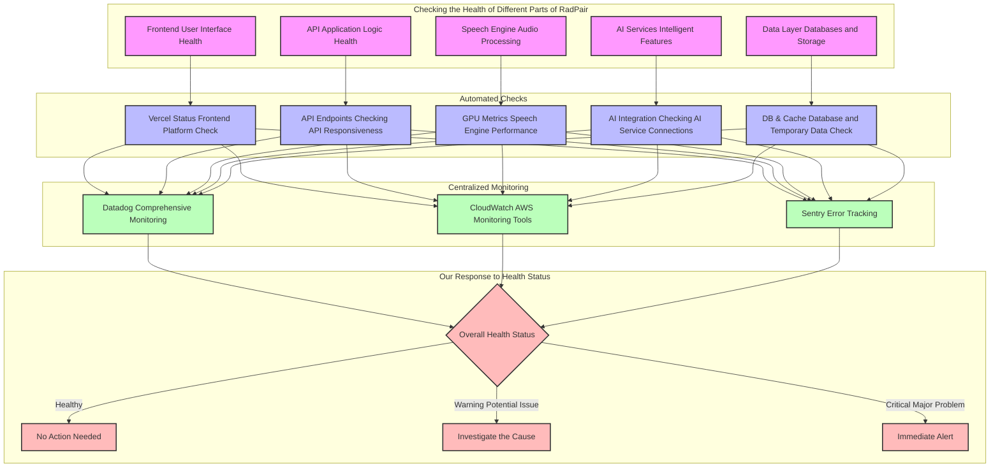
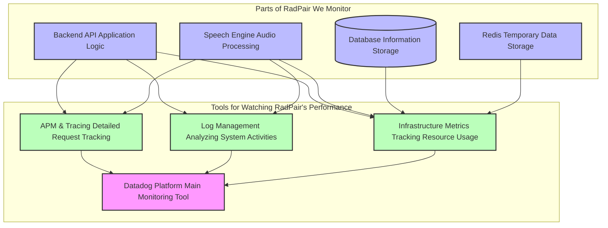
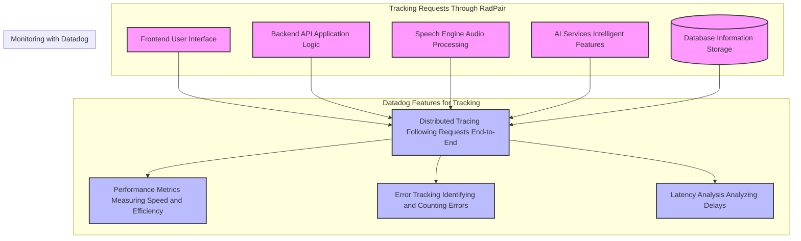
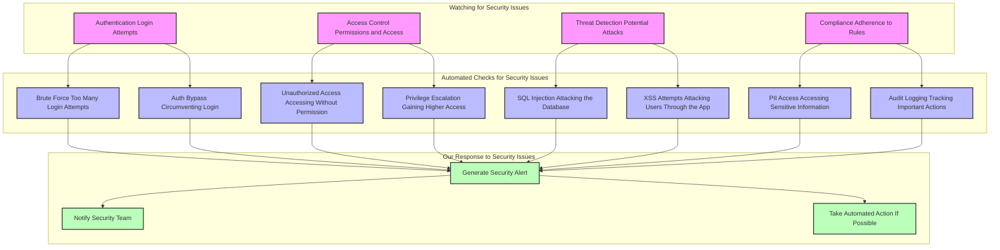
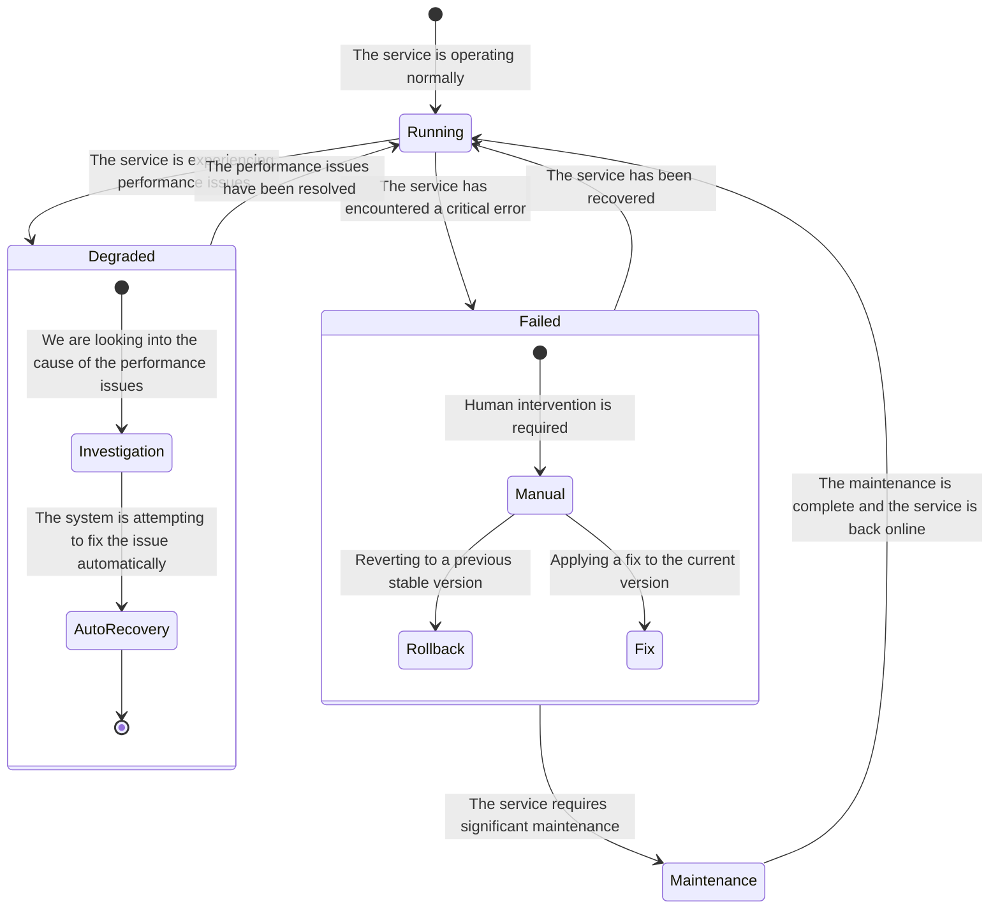
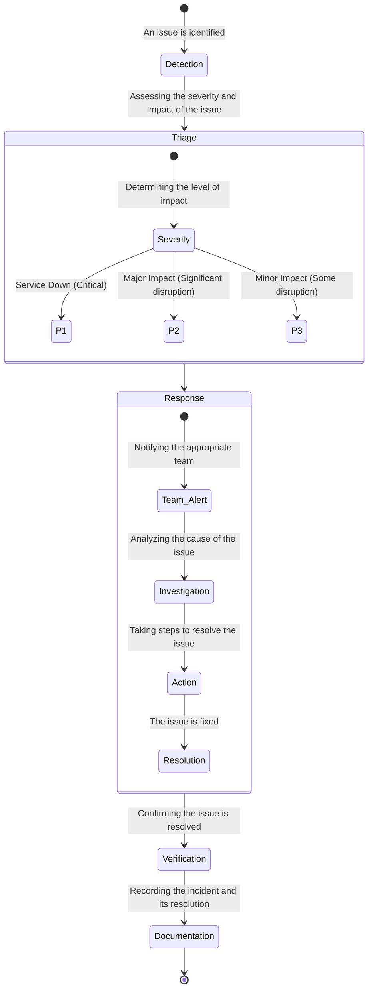
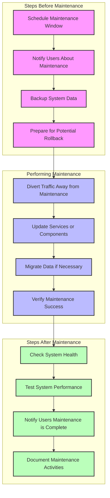

# RadPair Operations Guide

## Table of Contents
1. [Keeping RadPair Running (Daily Operations)](#keeping-radpair-running-daily-operations)
2. [Managing RadPair Resources](#managing-radpair-resources)
3. [Responding to Issues (Incident Management)](#responding-to-issues-incident-management)
4. [Performing Maintenance on RadPair](#performing-maintenance-on-radpair)
5. [Who to Contact for Help](#who-to-contact-for-help)

## Keeping RadPair Running (Daily Operations)

This section describes the routine tasks and checks to ensure RadPair operates smoothly.

### Monitoring RadPair's Health

We continuously monitor the health of all RadPair components to catch potential issues early.

#### How We Check Health



This diagram illustrates the automated health checks performed on different RadPair components and how we respond to the findings.

#### Commands to Manually Check Health

While most checks are automated, here are commands for manual checks:

```bash
# Check the Health of the User Interface
curl https://radpair.com/health

# Check the Health of the Application Logic
curl https://api.radpair.com/health

# Check the Health of the Audio Processing Service
curl https://stt.radpair.com/health

# Check the Health of the Database Connection
copilot svc exec --app platform-api --name backend-api --env prod \
  --command "python -c 'from app import db; db.engine.connect()'"

# Check the Health of the Temporary Data Storage (Cache)
copilot svc exec --app platform-api --name backend-api --env prod \
  --command "redis-cli -h $REDIS_HOST ping"

# Check the Health of the AI-Powered Features
curl https://api.radpair.com/ai/health
```

These commands can be run to verify the status of different parts of the RadPair platform.

### Reviewing System Logs

Logs provide detailed records of what's happening within RadPair, helping us identify issues and understand system behavior.

#### Accessing Logs via Datadog

Datadog is our primary tool for viewing and analyzing logs. Here are examples of how to search for logs:

```yaml
# Examples of Searching Logs in Datadog
queries:
  # View logs specifically from the main application
  backend_api: "service:backend-api env:prod"
  # View logs specifically from the audio processing service
  speech_engine: "service:speech-engine env:prod"

  # Find any logs indicating errors
  errors: "service:* status:error env:prod"

  # View logs related to our AI features
  ai_services: "service:* tags:ai env:prod"

  # See recent activity in the main application, including surrounding context
  recent_with_context: "service:backend-api env:prod @timestamp:>now-30m"
```

These queries help filter and view relevant log information.

#### Key Log Information

When reviewing logs, we look for specific details:

```yaml
# Important Details Found in Logs
facets:
  - service           # Identifies which part of RadPair generated the log
  - env              # Indicates the environment (production, staging)
  - status           # Shows the severity of the log (error, warning, informational)
  - http.status_code # For web requests, shows if the request was successful
  - http.method      # The type of web request (e.g., GET, POST)
  - user_id          # If applicable, identifies the user involved
  - trace_id         # Links related log entries together for a single request
```

```yaml
# Performance-related Measurements in Logs
measures:
  - http.latency     # How long web requests take to complete
  - memory.usage     # How much memory different parts of RadPair are using
  - gpu.utilization  # For audio processing, how much the specialized hardware is being used
```

These details help diagnose performance issues and understand user activity.

#### How Logs are Collected

We use a technology called Firelens to collect and forward logs to Datadog:

```yaml
# Configuration for Collecting Logs
firelens_configuration:
  type: fluentbit
  options:
    enable-ecs-log-metadata: true  # Adds helpful information about where the log came from
    config-file-type: file
    config-file-value: /fluent-bit/etc/extra.conf

# Specific settings for sending logs to Datadog
custom_configuration:
  outputs: |
    [OUTPUT]
        Name datadog
        Match *
        Host http-intake.logs.datadoghq.com # Where to send the logs
        TLS on                         # Encrypt the logs during transfer
        compress gzip                  # Reduce the size of logs being sent
        apikey ${DD_API_KEY}           # Secure key for sending logs to Datadog
        dd_service $(service)          # Identify the service the log is from
        dd_source fluentbit            # Identify the log collector
        dd_tags env:prod               # Tag the logs as being from the production environment
```

This configuration ensures that logs from all parts of RadPair are securely collected and sent to Datadog for analysis.

### Monitoring Performance

We continuously track RadPair's performance to ensure it's fast and reliable.

#### Tools We Use for Performance Monitoring



This diagram shows the different tools and components we monitor to ensure optimal performance.

#### Key Performance Indicators and Dashboards

We use dashboards to visualize important performance metrics:

1. **Overall Service Health Dashboard:**
   ```yaml
   widgets:
     - name: "Tracking How Busy Our Services Are"
       type: group
       widgets:
         - name: "Number of Requests"
           query: "sum:trace.flask.request.hits{service:backend-api} by {http.status_code}" # Shows successful and failed requests
         - name: "Percentage of Failed Requests"
           query: "sum:trace.flask.request.errors{service:backend-api}.as_rate()"        # Highlights error rates
         - name: "Time Taken for Requests (95th Percentile)"
           query: "p95:trace.flask.request.duration{service:backend-api}"               # Shows the time taken for most requests
     - name: "How Much Resources Are Being Used"
       type: group
       widgets:
         - name: "Memory Usage"
           query: "avg:docker.memory.rss{service:backend-api}"                         # Tracks memory usage
         - name: "CPU Usage"
           query: "avg:docker.cpu.usage{service:backend-api}"                            # Tracks CPU usage
   ```

2. **Speech Engine Performance Dashboard:**
   ```yaml
   widgets:
     - name: "Specialized Hardware (GPU) Performance"
       type: group
       widgets:
         - name: "How Busy the GPUs Are"
           query: "avg:nvidia.gpu.utilization{service:speech-engine}"                   # Tracks GPU utilization
         - name: "GPU Memory Usage"
           query: "avg:nvidia.gpu.memory_used{service:speech-engine}"                  # Tracks GPU memory usage
     - name: "Audio Processing Performance"
       type: group
       widgets:
         - name: "Time Taken to Process Audio"
           query: "avg:speech.processing.duration{service:speech-engine}"              # Tracks audio processing time
         - name: "Number of Audio Tasks Waiting"
           query: "avg:speech.queue.length{service:speech-engine}"                     # Tracks the number of pending audio tasks
   ```

These dashboards provide a snapshot of RadPair's performance and resource utilization.

### Monitoring with Datadog

Datadog is central to our monitoring strategy, providing detailed insights and alerting capabilities.

#### How We Use Datadog for Monitoring



This diagram illustrates how Datadog's features help us monitor different parts of RadPair.

#### Key Performance Metrics We Watch

| Metric             | What's Considered a Warning? | What's Considered Critical? | What It Tells Us                               |
|--------------------|-----------------------------|-----------------------------|-----------------------------------------------|
| Apdex Score        | Less than 0.8               | Less than 0.7               | How satisfied users are with the performance   |
| Error Rate         | More than 1%                | More than 5%                | Percentage of requests that are failing        |
| P95 Latency        | More than 500 milliseconds  | More than 1 second          | The time it takes for most requests to complete |
| Database Query Time| More than 100 milliseconds  | More than 500 milliseconds  | How long our database queries are taking        |

These metrics help us understand the health and performance of RadPair.

#### Managing Logs

Datadog also helps us manage and analyze logs:

```yaml
# How We Tell Datadog Where to Collect Logs
logs:
  - type: container
    service: backend-api
    source: python
    tags:
      - env:prod
      - service:api
  - type: container
    service: speech-engine
    source: python
    tags:
      - env:prod
      - service:stt
  - type: container
    service: frontend
    source: javascript
    tags:
      - env:prod
      - service:frontend
```

```yaml
# Rules for Cleaning Up and Organizing Logs
processing_rules:
  - type: mask_sequences
    name: mask_sensitive_data
    pattern: '(password=)[^\s]*'
    replace_placeholder: 'password=*****' # Replace actual passwords with asterisks
  - type: status_remapper
    name: remap_errors
    sources: status # Standardize how errors are labeled
  - type: category_processor
    name: categorize_errors
    categories:
      - error: (?i)error|exception|fail    # Identify log entries as errors
      - warning: (?i)warn|warning          # Identify log entries as warnings
      - info: (?i)info|success            # Identify log entries as informational
```

These configurations help us collect, secure, and organize our logs effectively.

#### Monitoring for Security

Datadog also helps us monitor for potential security threats:



This diagram shows how we monitor for and respond to potential security issues.

```yaml
# Rules for Detecting Security Issues
rules:
  - name: brute_force_detection
    type: log_detection
    query: |
      @source:auth.log status:error "Failed login attempt"
      | count by client_ip > 10 # Alert if more than 10 failed attempts from one IP
    severity: high
    notification: security-team
  - name: sensitive_data_access
    type: log_detection
    query: |
      @source:api.log operation:read data_type:PII
      | count by user > threshold # Alert if a user accesses too much sensitive info
    severity: medium
    notification: compliance-team
  - name: unusual_api_activity
    type: anomaly
    query: |
      avg:api.requests{*} by {endpoint} # Detect unusual changes in API usage
    alert_window: last_15m
    severity: warning
    notification: platform-team
```

```yaml
# Setting Up Alerts for Security Issues
alerts:
  high_priority:
    notification:
      - channel: #security-alerts
      - email: security@radpair.com
      - pagerduty: security-oncall
    escalation:
      delay: 5m
      notify: security-lead
  medium_priority:
    notification:
      - channel: #platform-alerts
      - email: platform@radpair.com
    escalation:
      delay: 15m
      notify: platform-lead
  low_priority:
    notification:
      - channel: #general-alerts
    escalation:
      delay: 1h
      notify: ops-team
```

#### Example Monitoring Dashboards

Here are examples of dashboards we use to monitor RadPair:

1. **Overall Service Health:** Shows request rates, error rates, latency, and resource usage.
2. **Speech Engine Performance:** Tracks GPU usage, processing times, and task queue lengths.
3. **Security Overview:** Displays authentication events, failed access attempts, threat detections, and compliance violations.

#### Responding to Alerts

We have procedures for how to respond to different types of alerts:

1. **High Priority:** Immediate notification, automatic incident creation, with a 15-minute goal to start addressing the issue.
2. **Medium Priority:** Notification to the relevant team, with a 30-minute goal to start addressing the issue.
3. **Low Priority:** Notification via dashboards, addressed within the next business day.

## Managing RadPair Resources

This section covers how we manage the computing resources that RadPair uses.

### Managing Containers

Containers are the building blocks of our applications. Here's how we access and manage them:

```bash
# Access the command line within the main application container
copilot svc exec --app platform-api --name backend-api --env prod --command bash

# Access the command line within the audio processing container
copilot svc exec --app platform-api --name speech-engine --env prod --command bash

# See how the specialized hardware (GPUs) are being used
kubectl top pods -n speech-engine
```

These commands allow us to interact directly with the running containers for troubleshooting and maintenance.

### Understanding Service States

Our services can be in various states, indicating their operational status:



This diagram shows the different states a service can be in and the transitions between them.

### Scaling Resources Automatically

RadPair is designed to automatically adjust its resource usage based on demand.

```yaml
# How the main application scales automatically
scaling:
  cpu:
    target: 70    # Aim to keep CPU usage around 70%
    range: 2-10   # Scale between 2 and 10 instances
  memory:
    target: 80    # Aim to keep memory usage around 80%
  requests:
    target: 1000  # Scale based on the number of incoming requests

# How the audio processing service scales automatically
scaling:
  gpu:
    target: 80    # Aim to keep GPU usage around 80%
    range: 1-4    # Scale between 1 and 4 instances
  memory:
    target: 85    # Aim to keep memory usage around 85%
```

This configuration ensures that RadPair can handle varying levels of traffic and processing needs.

## Responding to Issues (Incident Management)

This section outlines how we respond to and manage incidents that affect RadPair's operation.

### How We Respond to Incidents



This diagram illustrates the process we follow when responding to incidents.

### Understanding Severity Levels

We classify incidents based on their impact:

| Level | What It Means                       | How Quickly We Respond | Who Gets Notified           |
|-------|------------------------------------|------------------------|---------------------------|
| P1    | The entire service is unavailable | Within 15 minutes      | All relevant teams        |
| P2    | A major part of the service is down | Within 30 minutes      | The platform team         |
| P3    | A minor part of the service is affected | Within 2 hours       | The on-call engineer      |
| P4    | A low-priority issue              | Within 1 business day  | Added to the regular queue |

This classification helps us prioritize and respond effectively to incidents.

## Performing Maintenance on RadPair

This section describes the procedures for performing maintenance on the RadPair platform.

### Scheduled Maintenance

Regular maintenance helps keep RadPair running smoothly and reliably.



This diagram outlines the steps involved in our scheduled maintenance process.

### Updating Services

Here's how we update the different parts of RadPair:

```bash
# Steps to Update a Service
# 1. Run checks before starting the update
./scripts/pre-update-check.sh

# 2. Update the main application
copilot svc deploy --name backend-api --env prod

# 3. Update the audio processing service
copilot svc deploy --name speech-engine --env prod

# 4. Check that the update was successful
./scripts/verify-deployment.sh
```

This ensures that updates are applied in a controlled and verified manner.

## Who to Contact for Help

This section provides information on who to contact for different types of issues.

### Emergency Contacts

For urgent issues, contact the following:

| Role              | How to Reach Them        | Expected Response Time |
|-------------------|-------------------------|------------------------|
| On-Call Engineer  | Slack: #platform-oncall  | 15 minutes             |
| Platform Lead     | Slack: #platform-lead    | 30 minutes             |
| AI Team Lead      | Slack: #ai-team         | 30 minutes             |
| DevOps Lead       | Slack: #devops-team      | 30 minutes             |

### Communication Channels

For non-urgent communication, use the following channels:

- **Slack (Primary)**: #platform-ops
- **Email**: ops@radpair.com
- **Phone**: Check the emergency contact list for critical issues
- **Status Page**: status.radpair.com for updates on known incidents

### Escalation Path

If an issue is not resolved in a timely manner, follow this escalation path:

1. **Level 1**: On-Call Engineer (Goal: Response within 15 minutes) - For initial assessment and basic troubleshooting.
2. **Level 2**: Platform/AI Team (Goal: Response within 30 minutes) - For deeper technical investigation and service recovery.
3. **Level 3**: Senior Engineer (Goal: Response within 1 hour) - For cross-team coordination and management of major incidents.
4. **Level 4**: Leadership (For critical business decisions and external communication).

---

*Last updated: 2024-03-19*
